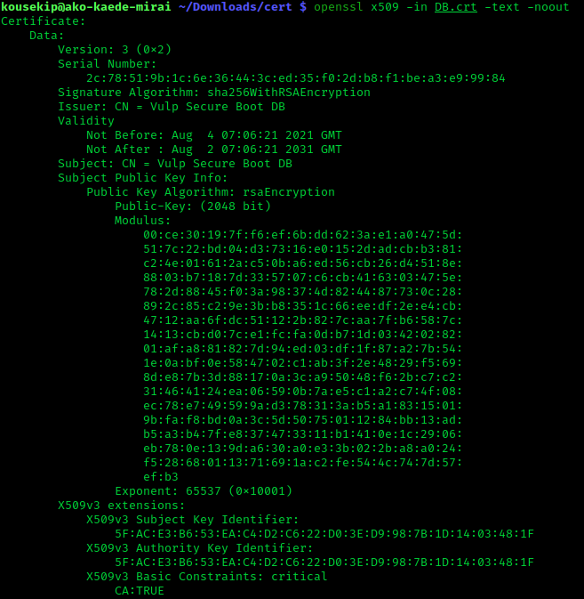

## Exercise 1 - Generate a key pair and encrypt/decrypt data.
 

This first exercise will illustrate the basics of using OpenSSL to generate a private-public key pair. [OpenSSL](https://en.wikipedia.org/wiki/OpenSSL) is a software library for applications that provide secure communications over computer networks against eavesdropping, and identify the party at the other end. It is widely used by Internet servers, including the majority of HTTPS websites. 

### Goals
- Understand the process of creating a certificate using OpenSSL or similar
- Understand some of the contents inside a certificate 
- Be able to manipulate a certificate using the CLI


### Instructions

1. Start by generating a Private Key with the following command:

    ```openssl genrsa -out private.key 2048```

    This will generate a private key in the current directory by using the [RSA](https://en.wikipedia.org/wiki/RSA_(cryptosystem)) algorithm - a relatively slow algorithm that relies on prime number factorisation for security. 

    Note that the two provided arguments above refer to the filename of the private key, and the key length measured in bits - in the case above, 2048 bits. 

2. Inspect the private key by executing 
    ```cat private.key```.


3. Even though the format of the file is text, the actual contents are not very sensible - we can use the following command to extract the information in a manner that is human readable:
```openssl rsa -text -in private.key -noout```

    What do you think these contents represent?

    <details> 
    <summary>Knowledge checkpoint</summary>
    These are the mathematical parameters used in the creation of the private key, stored in hexadecimal format. As mentioned, RSA uses prime numbers to generate private keys - you can notice terms related to number theory, such as modulus or exponent. More obviously, first prime and second prime indicate the prime numbers used in generating the private key. More info can be found in the RFC for RSA <a href=https://www.rfc-editor.org/rfc/rfc3447#appendix-A.1.1>here</a>
    </details>


4. As mentioned during the lecture, public and private keys come in pairs. You can extract the public key from the private key that was just generated by running
    ```openssl rsa -in private.key -pubout -out public.key```

5. Again, let's inspect the decoded contents of the public key:
    ```openssl rsa -text -pubin -in public.key -noout```

    What do you observe?
        <details> 
        <summary>Knowledge checkpoint</summary>
        The mathematical parameters in the decoded public key are a subset of the parameters of the private key, in particular the modulus and exponent. The basis of RSA is that of a one-way (trapdoor) function: Given just these two parameters, it is impossible to determine the other parameters present in the public key, such as the prime numbers used. Hence why it is completely fine to include these in the public key.  
        </details>

6. Finally, let's do something a bit more useful with these keys. 
    1. Start by editing the file [here](./message_to_be_encrypted.txt).
    2. Using the public key that was created earlier, encrypt the file above with the command ```openssl pkeyutl -encrypt -inkey public.key -pubin -in message_to_be_encrypted.txt -out encrypted_file.bin```
    This will produce a binary file as the output, containing the original message encrypted with the generated public key.
    3. Verify that the message is indeed encrypted by running any of the following commands, depending on your OS:
    - `cat encrypted_file.bin`
    - `xxd -b encrypted_file.bin`
    - `hexdump -C encrypted_file.bin`
    4. Decrypt the file with your private key: ```openssl pkeyutl -decrypt -inkey private.key -in encrypted_file.bin -out decrypted_file.txt```


## Extension task

In the folder [corrupted](./corrupted/), a message has been hidden in plain sight, containing an important reminder for today. Your task is to decipher the message.

Unfortunately, it is not as easy as it seems - it is not obvious which key was used to encrypt the file! There are 4 potential candidates present, and to top it off, some of the files have been corrupted, with strings being replaced with question marks: `???` Your task boils down to the following subtasks:

1. Identify the correct key 
2. Fix any data corruption
3. Decode the encrypted file.


Use the hints below for help. Good luck!

<details> 
<summary>Hint 1</summary>
The only knowledge necessary to achieve this task is what has been covered in previous exercises. If something seems unfamiliar, don't dwell on it too much.
</details>

<details> 
<summary>Hint 2</summary>
It may be useful to refer to the certificates you generated previously, and compare them with the corrupt ones.
</details>

<details> 
<summary>Hint 3</summary>
You're almost certainly looking for a private key. Which candidate resembles an RSA private key file the most?
</details>

<details> 
<summary>Solution</summary>
1.key is the correct file; in addition to that, the ??? need to be replaced with the word PRIVATE. Following that, simply execute the decryption command as illustrated above to get the decrypted file.
</details>