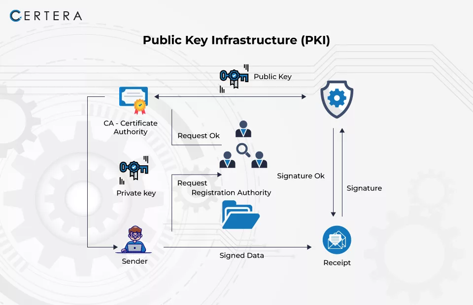

## Task 2 - Generate a self-signed certificate


In this exercise, we will look into generating a self-signed X.509 certificate via a certificate signing request, using OpenSSL.

### Goals
- Generate a self-signed X.509 certificate in OpenSSL and verify it
- Create a Certificate Signing Request (CSR)


### Instructions
0. Ensure you are in the [Task 2 directory](.) by using `cd` or your OS' equivalent command to navigate there. 
1. Start by generating a Private Key with the following command:

    ```openssl genpkey -algorithm RSA -out private.key```

    This will generate a private key in the current directory by using the [RSA](https://en.wikipedia.org/wiki/RSA_(cryptosystem)) algorithm - as in the previous task, albeit with a slighty different command. 

2. Create a certificate signing request (CSR): ```openssl req -new -key private.key -out request.csr```
   You will be prompted to fill in details - feel free to use the defaults, or mock data. 
   The command first generates the public key corresponding to `private.key`, then it bundles it up with the metadata you just entered into a CSR file. Note that the private key is not part of this bundle!

3. At this point, we would usually submit the CSR to a Certificate Authority and wait for it to sign the certificate - however, for the purposes of this task, we will sign the certificate ourselves:
```openssl x509 -req -in request.csr -signkey private.key    Po -out certificate.crt``` 

    Note that in a real world setting, this certificate would be rather useless - can you guess why? 
    <details> 
    <summary>Knowledge checkpoint</summary>
    Simply because no one would be able to verify the Certificate Authority, as we just created it locally. Most applications would complain with an error along the lines of CERTIFICATION AUTHORITY INVALID. 
    Most browsers and operating systems have a list of valid Certificate Authorities, and to trust a certificate as valid, it needs to be traced to one of these authorities. 
    </details>


4. To view the contents of the certificate, you can run: ```openssl x509 -noout -text -in certificate.crt```
    Inspecting the output, what tells you that this is a self-signed certificate?
    <details> 
    <summary>Knowledge checkpoint</summary>
    The Issuer is the same as the Subject.
    </details>

5. It is also good practice to verify that the certificate and the private key match. You can do this by running:
    ```
    openssl x509 -noout -in certificate.crt | openssl md5
    openssl pkey -in private.key -noout | openssl md5
    ```

